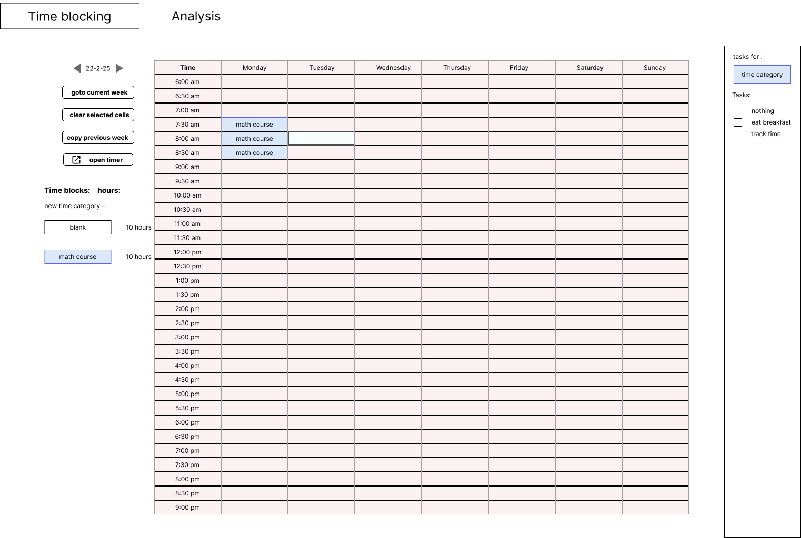
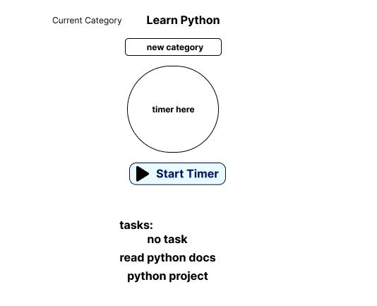

# Time Management App

A simple time-blocking and task-tracking web application built with React.

## Features
- Task creation and time-blocking
- Pomodoro-style timers
- Analytics dashboard

## Tech Stack
- **Frontend:** React, TypeScript, Tailwind CSS
- **Backend (Planned):** Python (Django/FastAPI)
- **Database (Planned):** PostgreSQL
- **Deployment:** TBD

## Design images




## Installation
1. Clone the repo:
   ```bash
   git clone https://github.com/yourusername/time-management-app.git
